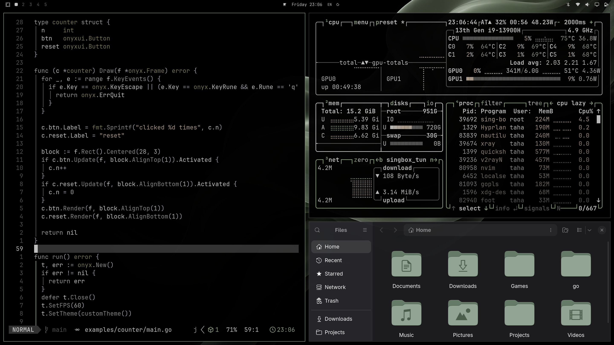

# Noir — Omarchy theme (Dawn variant)

A dark theme for the whole desktop. Soft black background (`#1c1c1c`), warm grey text,
muted sage accents. Includes matching Neovim and Zed themes.

Built for current Omarchy (quattro) and the latest Lua-based Hyprland.
Hyprland colors ship as `hyprland.lua`, applied on top of Omarchy's
defaults by the theme system.

## Preview

## Palette

| Role       | Hex       | Used for               |
| ---------- | --------- | ---------------------- |
| `bg`       | `#1c1c1c` | Background             |
| `alt_bg`   | `#333333` | Panels, hovers, status |
| `fg`       | `#c1c1c1` | Foreground             |
| `comment`  | `#505050` | Comments               |
| `constant` | `#aaaaaa` | Constants, numbers     |
| `func`     | `#888888` | Functions              |
| `keyword`  | `#999999` | Keywords, storage      |
| `operator` | `#9b99a3` | Operators, punctuation |
| `string`   | `#aa9988` | Strings                |
| `type`     | `#777755` | Types, classes         |
| `visual`   | `#333333` | Selection              |
| `accent`   | `#8a9a7b` | Accent, focus, tags    |

## Variant

This is the **dawn** variant — a softer black that's easier on the eyes
in well-lit environments. For pure black (`#000000`), use the main
[omarchy-noir-theme](https://github.com/tahadx/omarchy-noir-theme) repo.

## License

MIT
