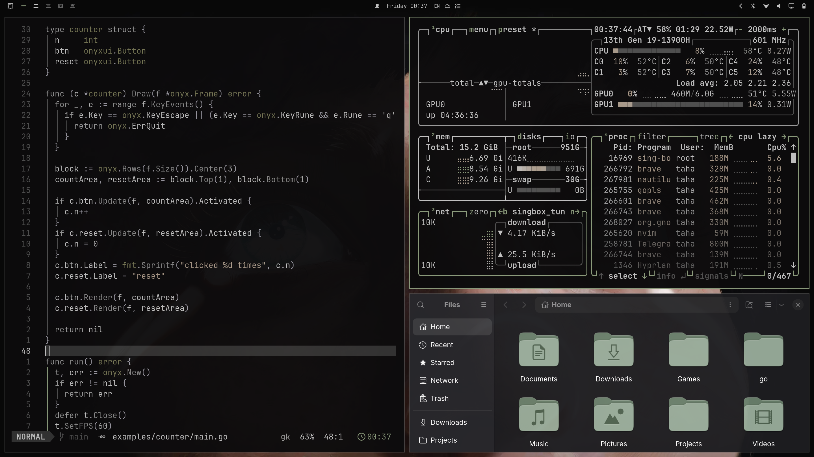

# Noir Dawn — Omarchy theme

A dark theme for the whole desktop. Soft black background (`#0c0b0c`), warm grey text,
muted sage accents.

Built for Omarchy Quattro

## Install

```bash
omarchy theme install https://github.com/tahadx/omarchy-noir-dawn-theme.git
```

## Neovim

Omarchy doesn't ship a Neovim template for community themes, so set it up manually
with [noir.nvim](https://github.com/tahadx/noir.nvim). Save the snippet below
as `~/.config/nvim/lua/plugins/noir.lua`:

```lua
return {
  {
    "tahadx/noir.nvim",
    priority = 1000,
    config = true,
    opts = {
      variant = "dawn",
    },
  },
  {
    "LazyVim/LazyVim",
    opts = {
      colorscheme = "noir",
    },
  },
}
```

## Zed

Omarchy has no Zed integration, so set it up manually. Save the snippet below
as `~/.config/zed/themes/noir-dawn.json`:

```json
{
  "$schema": "https://zed.dev/schema/themes/v0.2.0.json",
  "name": "Noir Dawn",
  "author": "Taha Sadough",
  "themes": [
    {
      "name": "Noir Dawn",
      "appearance": "dark",
      "style": {
        "background": "#0c0b0c",
        "border": "#33333340",
        "border.variant": "#33333360",
        "border.focused": "#8a9a7b",
        "border.selected": "#8a9a7b80",
        "border.transparent": "#0c0b0c00",
        "border.disabled": "#33333330",
        "elevated_surface.background": "#1c1c1c",
        "surface.background": "#1c1c1c",
        "element.background": "#1c1c1c",
        "element.hover": "#33333340",
        "element.active": "#8a9a7b30",
        "element.selected": "#8a9a7b25",
        "element.disabled": "#33333320",
        "drop_target.background": "#8a9a7b20",
        "ghost_element.background": "#0c0b0c00",
        "ghost_element.hover": "#1c1c1c",
        "ghost_element.active": "#8a9a7b30",
        "ghost_element.selected": "#8a9a7b25",
        "ghost_element.disabled": "#33333320",
        "text": "#c1c1c1",
        "text.muted": "#505050",
        "text.placeholder": "#505050",
        "text.disabled": "#50505080",
        "text.accent": "#8a9a7b",
        "icon": "#c1c1c1",
        "icon.muted": "#505050",
        "icon.disabled": "#50505060",
        "icon.placeholder": "#505050",
        "icon.accent": "#8a9a7b",
        "status_bar.background": "#1c1c1c",
        "title_bar.background": "#1c1c1c",
        "title_bar.inactive_background": "#1c1c1c",
        "toolbar.background": "#0c0b0c",
        "tab_bar.background": "#1c1c1c",
        "tab.inactive_background": "#1c1c1c",
        "tab.active_background": "#0c0b0c",
        "search.match_background": "#8a9a7b",
        "panel.background": "#1c1c1c",
        "panel.focused_border": "#8a9a7b",
        "pane.focused_border": "#8a9a7b",
        "scrollbar.thumb.background": "#33333330",
        "scrollbar.thumb.hover_background": "#33333360",
        "scrollbar.thumb.border": "#33333320",
        "scrollbar.track.background": "#0c0b0c00",
        "scrollbar.track.border": "#0c0b0c00",
        "editor.foreground": "#c1c1c1",
        "editor.background": "#0c0b0c",
        "editor.gutter.background": "#0c0b0c",
        "editor.subheader.background": "#1c1c1c",
        "editor.active_line.background": "#1c1c1c",
        "editor.highlighted_line.background": "#8a9a7b15",
        "editor.line_number": "#505050",
        "editor.active_line_number": "#c1c1c1",
        "editor.invisible": "#33333340",
        "editor.wrap_guide": "#33333330",
        "editor.active_wrap_guide": "#33333360",
        "editor.document_highlight.read_background": "#8a9a7b20",
        "editor.document_highlight.write_background": "#8a9a7b30",
        "terminal.background": "#0c0b0c",
        "terminal.foreground": "#c1c1c1",
        "terminal.bright_foreground": "#d1d1d1",
        "terminal.dim_foreground": "#505050",
        "terminal.ansi.black": "#1c1c1c",
        "terminal.ansi.bright_black": "#505050",
        "terminal.ansi.dim_black": "#1c1c1c80",
        "terminal.ansi.red": "#8a9a7b",
        "terminal.ansi.bright_red": "#8a9a7b",
        "terminal.ansi.dim_red": "#8a9a7b80",
        "terminal.ansi.green": "#c1c1c1",
        "terminal.ansi.bright_green": "#c1c1c1",
        "terminal.ansi.dim_green": "#c1c1c180",
        "terminal.ansi.yellow": "#888888",
        "terminal.ansi.bright_yellow": "#888888",
        "terminal.ansi.dim_yellow": "#88888880",
        "terminal.ansi.blue": "#aaaaaa",
        "terminal.ansi.bright_blue": "#aaaaaa",
        "terminal.ansi.dim_blue": "#aaaaaa80",
        "terminal.ansi.magenta": "#999999",
        "terminal.ansi.bright_magenta": "#999999",
        "terminal.ansi.dim_magenta": "#99999980",
        "terminal.ansi.cyan": "#aa9988",
        "terminal.ansi.bright_cyan": "#aa9988",
        "terminal.ansi.dim_cyan": "#aa998880",
        "terminal.ansi.white": "#c1c1c1",
        "terminal.ansi.bright_white": "#d1d1d1",
        "terminal.ansi.dim_white": "#c1c1c180",
        "link_text.hover": "#8a9a7b",
        "conflict": "#8a9a7b",
        "conflict.background": "#8a9a7b15",
        "conflict.border": "#8a9a7b",
        "created": "#6e4c4c",
        "created.background": "#6e4c4c15",
        "created.border": "#6e4c4c",
        "deleted": "#8a9a7b",
        "deleted.background": "#8a9a7b15",
        "deleted.border": "#8a9a7b",
        "error": "#8a9a7b",
        "error.background": "#8a9a7b15",
        "error.border": "#8a9a7b",
        "hidden": "#505050",
        "hidden.background": "#50505015",
        "hidden.border": "#505050",
        "hint": "#8a9a7b",
        "hint.background": "#8a9a7b15",
        "hint.border": "#8a9a7b",
        "ignored": "#505050",
        "ignored.background": "#50505015",
        "ignored.border": "#505050",
        "info": "#8a9a7b",
        "info.background": "#8a9a7b15",
        "info.border": "#8a9a7b",
        "modified": "#8a9a7b",
        "modified.background": "#8a9a7b15",
        "modified.border": "#8a9a7b",
        "predictive": "#505050",
        "predictive.background": "#50505015",
        "predictive.border": "#50505040",
        "renamed": "#aa9988",
        "renamed.background": "#aa998815",
        "renamed.border": "#aa9988",
        "success": "#6e4c4c",
        "success.background": "#6e4c4c15",
        "success.border": "#6e4c4c",
        "unreachable": "#505050",
        "unreachable.background": "#50505015",
        "unreachable.border": "#505050",
        "warning": "#8a9a7b",
        "warning.background": "#8a9a7b15",
        "warning.border": "#8a9a7b",
        "players": [
          {
            "cursor": "#c1c1c1",
            "selection": "#c1c1c160",
            "background": "#aaaaaa"
          },
          {
            "cursor": "#aa9988",
            "selection": "#aa998840",
            "background": "#aa9988"
          },
          {
            "cursor": "#999999",
            "selection": "#99999940",
            "background": "#999999"
          },
          {
            "cursor": "#888888",
            "selection": "#88888840",
            "background": "#888888"
          },
          {
            "cursor": "#c1c1c1",
            "selection": "#c1c1c140",
            "background": "#c1c1c1"
          },
          {
            "cursor": "#8a9a7b",
            "selection": "#8a9a7b40",
            "background": "#8a9a7b"
          },
          {
            "cursor": "#aaaaaa",
            "selection": "#aaaaaa40",
            "background": "#aaaaaa"
          },
          {
            "cursor": "#8a9a7b",
            "selection": "#8a9a7b40",
            "background": "#8a9a7b"
          }
        ],
        "syntax": {
          "attribute": {
            "color": "#c1c1c1",
            "font_style": null,
            "font_weight": null
          },
          "boolean": {
            "color": "#aaaaaa",
            "font_style": null,
            "font_weight": null
          },
          "comment": {
            "color": "#505050",
            "font_style": "italic",
            "font_weight": null
          },
          "comment.doc": {
            "color": "#505050",
            "font_style": "italic",
            "font_weight": null
          },
          "constant": {
            "color": "#aaaaaa",
            "font_style": null,
            "font_weight": null
          },
          "constructor": {
            "color": "#777755",
            "font_style": null,
            "font_weight": null
          },
          "embedded": {
            "color": "#c1c1c1",
            "font_style": null,
            "font_weight": null
          },
          "emphasis": {
            "color": "#c1c1c1",
            "font_style": "italic",
            "font_weight": null
          },
          "emphasis.strong": {
            "color": "#c1c1c1",
            "font_style": null,
            "font_weight": 700
          },
          "enum": {
            "color": "#777755",
            "font_style": null,
            "font_weight": null
          },
          "function": {
            "color": "#888888",
            "font_style": null,
            "font_weight": null
          },
          "function.builtin": {
            "color": "#888888",
            "font_style": null,
            "font_weight": null
          },
          "function.definition": {
            "color": "#888888",
            "font_style": null,
            "font_weight": null
          },
          "function.method": {
            "color": "#888888",
            "font_style": null,
            "font_weight": null
          },
          "function.special.definition": {
            "color": "#888888",
            "font_style": null,
            "font_weight": null
          },
          "hint": {
            "color": "#505050",
            "font_style": "italic",
            "font_weight": null
          },
          "keyword": {
            "color": "#999999",
            "font_style": null,
            "font_weight": null
          },
          "label": {
            "color": "#999999",
            "font_style": null,
            "font_weight": null
          },
          "link_text": {
            "color": "#8a9a7b",
            "font_style": "underline",
            "font_weight": null
          },
          "link_uri": {
            "color": "#8a9a7b",
            "font_style": "underline",
            "font_weight": null
          },
          "number": {
            "color": "#aaaaaa",
            "font_style": null,
            "font_weight": null
          },
          "operator": {
            "color": "#9b99a3",
            "font_style": null,
            "font_weight": null
          },
          "predictive": {
            "color": "#505050",
            "font_style": "italic",
            "font_weight": null
          },
          "preproc": {
            "color": "#999999",
            "font_style": null,
            "font_weight": null
          },
          "primary": {
            "color": "#c1c1c1",
            "font_style": null,
            "font_weight": null
          },
          "property": {
            "color": "#c1c1c1",
            "font_style": null,
            "font_weight": null
          },
          "punctuation": {
            "color": "#9b99a3",
            "font_style": null,
            "font_weight": null
          },
          "punctuation.bracket": {
            "color": "#9b99a3",
            "font_style": null,
            "font_weight": null
          },
          "punctuation.delimiter": {
            "color": "#9b99a3",
            "font_style": null,
            "font_weight": null
          },
          "punctuation.list_marker": {
            "color": "#9b99a3",
            "font_style": null,
            "font_weight": null
          },
          "punctuation.special": {
            "color": "#8a9a7b",
            "font_style": null,
            "font_weight": null
          },
          "string": {
            "color": "#aa9988",
            "font_style": null,
            "font_weight": null
          },
          "string.escape": {
            "color": "#8a9a7b",
            "font_style": null,
            "font_weight": null
          },
          "string.regex": {
            "color": "#aa9988",
            "font_style": null,
            "font_weight": null
          },
          "string.special": {
            "color": "#aa9988",
            "font_style": null,
            "font_weight": null
          },
          "string.special.symbol": {
            "color": "#aa9988",
            "font_style": null,
            "font_weight": null
          },
          "tag": {
            "color": "#8a9a7b",
            "font_style": null,
            "font_weight": null
          },
          "text.literal": {
            "color": "#aa9988",
            "font_style": null,
            "font_weight": null
          },
          "title": {
            "color": "#8a9a7b",
            "font_style": null,
            "font_weight": 700
          },
          "type": {
            "color": "#777755",
            "font_style": null,
            "font_weight": null
          },
          "type.builtin": {
            "color": "#777755",
            "font_style": null,
            "font_weight": null
          },
          "type.interface": {
            "color": "#777755",
            "font_style": null,
            "font_weight": null
          },
          "type.super": {
            "color": "#777755",
            "font_style": null,
            "font_weight": null
          },
          "variable": {
            "color": "#c1c1c1",
            "font_style": null,
            "font_weight": null
          },
          "variable.member": {
            "color": "#c1c1c1",
            "font_style": null,
            "font_weight": null
          },
          "variable.parameter": {
            "color": "#c1c1c1",
            "font_style": null,
            "font_weight": null
          },
          "variable.special": {
            "color": "#aaaaaa",
            "font_style": null,
            "font_weight": null
          },
          "variant": {
            "color": "#777755",
            "font_style": null,
            "font_weight": null
          }
        }
      }
    }
  ]
}
```

Then in Zed: command palette → `zed: select theme` → **Noir Dawn**.

## Preview



## Palette

| Role       | Hex       | Used for               |
| ---------- | --------- | ---------------------- |
| `bg`       | `#0c0b0c` | Background             |
| `alt_bg`   | `#1c1c1c` | Panels, hovers, status |
| `fg`       | `#c1c1c1` | Foreground             |
| `comment`  | `#505050` | Comments               |
| `constant` | `#aaaaaa` | Constants, numbers     |
| `func`     | `#888888` | Functions              |
| `keyword`  | `#999999` | Keywords, storage      |
| `operator` | `#9b99a3` | Operators, punctuation |
| `string`   | `#aa9988` | Strings                |
| `type`     | `#777755` | Types, classes         |
| `visual`   | `#333333` | Selection              |
| `accent`   | `#8a9a7b` | Accent, focus, tags    |

## Omarchy shell

`shell.toml` styles the Quickshell surfaces: bar, menus (`Super+K`
keybindings, clipboard, emojis), launcher, tooltips, popups, notifications,
lock, and polkit cards. Menus, launcher, and tooltips use the sage
active-border instead of Omarchy's default grey. It ships with the theme and
is picked up automatically on `omarchy theme set noir-dawn`.

## License

MIT
